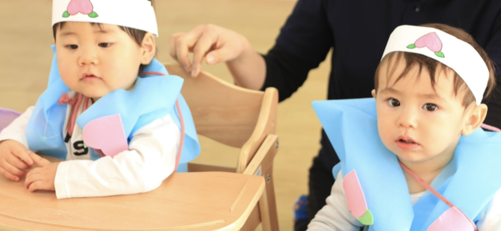

_Today’s Solid Food Menu:_

**Breakfast**

- Milk (dairy, 10 teaspoonsful)
- Strawberry (1)
- Banana (25g)
- Oatmeal (100g) with some white bread

(lunch at nursery school)

**Dinner**

- Tuna (25g)
- Strawberries (2)
- Mushrooms (5g)
- Mixed vegetables (30g)
- Soft rice (90g)

Some more photos this morning of my face showing my swollen lip. Fortunately, my lip is healing fast!

A photo made by my teachers today at nursery school.

## Video Stills

Here are some screenshots of videos made recently by the staff at my nursery school.

We’re at morning assembly (*asa no kai* 朝の会).

Our teachers are taking us to the playground before lunch.

It’s lunch time!

We’re all taking a nap after lunch.

Here, we’re at the evening assembly before going home (*kaeri no kai* 帰りの会).

### Momotarō

The following video stills are of a play 🎭 we performed at nursery school!

The play’s title was “<a href="https://en.wikipedia.org/wiki/Momotar%C5%8D">Peach Boy</a>” (*Momotarō* 桃太郎). Momotarō is a popular hero in Japanese folklore. Here is the giant peach 🍑 Momotarō was born from.

We all took turns emerging from the giant peach as Momotarō. It’s my turn now!

I’m Momotarō!

Exit stage left…

Momotarō has left his parents to fight a band of demons on Demon Island (*Onigashima* 鬼ヶ島).

We’ve arrived on Demon Island. 🏝

Look! There’s a talking dog! 🐕

Momotarō befriends the dog, and also a talking monkey 🐒 and pheasant 🐦!

Momotarō and his new friends spot the demons, and penetrate their fort 🏯…

A battle ensues…

… and the demons are beaten into surrendering. ⚐

The victorious Momotarō ✌️ and his animal friends 🐕🐒🐦 return home.

They bring back treasure 🏆 plundered from the demons.

They celebrate their victory! 🎉

The End. 🎬

